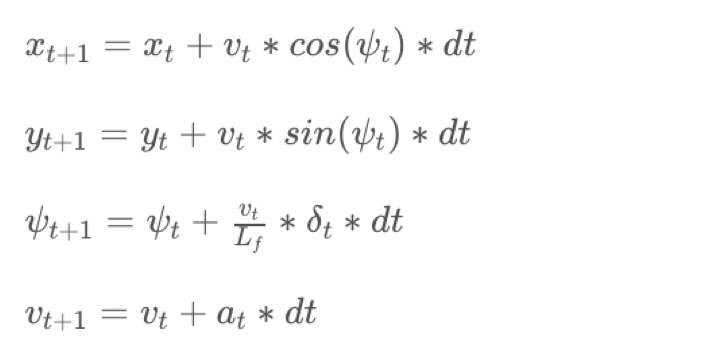
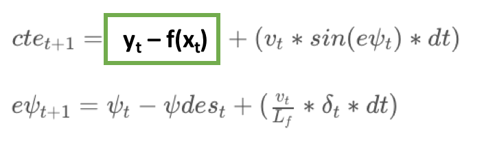

# CarND-Controls-MPC

Self-Driving Car Engineer Nanodegree Program

---

My solution answers the Udacity [passing requirements.](https://review.udacity.com/#!/rubrics/896/view)


## Introduction

In this project we are asked to implement a Model Predictive Controler (MPC) to actuate the car to follow a trajectory. The car can be actuated by modifying its acceleration and the steering wheels angle.
The car in question is living in a [simulator](https://github.com/udacity/self-driving-car-sim/releases) provided by Udacity. The communication is done via WebSocket.

## Implementation - Rubric Points

#### External Libraries

To fulfill this project, Udacity suggested me to use the IPOPT and CPPAD libraries to respectively solve the optimal trajectory based on a set of input parameter and to calculate derivatives more easily.

### The Model

The model I've used is the usual Kinematic Bicycle Model defined by the equations bellow:




The only vehicle parameter is `Lf` which represents the distance from the car's center of gravity to the steering axle in order to approximate the effective turning radius. The value for `Lf` was left equal to 2.67 m as determined experimentally in the simulator by Udacity.

My vector of state variables : `[x, y, psi, v, Cte, Epsi]`

`x` and `y` are the car's position, `psi` is the car heading, `v` its linear velocity, `Cte` the cross-track error and `Epsi` the heading error.  

My actuator vector : `[delta, a]`

`Delta` is the steering angle and `a` is the acceleration (1 is full throttle and -1 is full braking).

_Note : Thanks to [Edufford](https://github.com/edufford) for the correction of the fifth equation._

### Timestep Length and Elapsed Duration (N & dt)

To predict the car trajectory, I first need to choose its length. The few steps along the path are fully determined by their number `N` and the time between them `dt`.
The more steps there are, the longer the calculation/runtime but the fewer steps, the less accurate the trajectory becomes because the car is "short-sighted".

* After some testing, I found that choosing `N = 8` for the number of steps used in the optimal trajectory calculation was optimal.
* A timestep of `dt = 0.10` (in seconds) was relatively long given that I tried driving over 100mph and allows the car the *see* far ahead. I experienced an accumulation of error over timesteps when `dt` was to far below the induced latency.

I tried the following `N` and `dt` associations:
- `5` and `0.15`
- `10` and `0.05`
- `8` and `0.15`


### Polynomial Fitting and MPC Preprocessing

* The waypoints that represent the center of the road are first transposed into the car coordinate system so that the car is now at the origin `(0,0)` with a null angle as well.

* The waypoints are then used to fit a 3rd order polynomial that is used as the trajectory ground truth.


### Model Predictive Control with Latency

Model Predictive Control tries to match a trajectory based on some ground-truth and some constraints. In my case here are some of the constraints I've chosen to apply:

| Physical Measure | Explanation | Variable | Weight|
|:---:|:---:|:---:|:---:|
|Cross Track Error | To keep the car close the center of the road | `cteErrorWeight` | 20 |
|Error in angle | To keep the car heading in the right direction | `epsiErrorWeight` | 20 |
|Difference from target speed | To keep the car to drive at the required speed | `deltaSpeedErrorWeight` | 1 |
| Steering penalty | To prevent the car from steering to much | `steeringErrorWeight` | 1 |
| Acceleration penalty | To prevent the car from accelerating and decelerating too much | `accelerationErrorWeight` | 1 |
| Consecutive steering actuation penalty | To prevent the car from steering too abruptly | `diffSteeringErrorWeight` | 1 |
| Consecutive acceleration values penalty | To prevent the car from accelerating of slowing too sharply | `diffAccelErrorWeight` | 1 |
| Acceleration and Steering Penalty | To prevent accelerating and steering at the same time (computer as the multiplication of the 2 entities) <b>It is the most important weight.</b> | `steerAccelErrorWeight` | 100 |

The trajectory is defined to respect these constraints. Only the first timestep (actuator values of throttle and steering) will be sent to the simulator. Although, before that, an arbitrary 100ms must be waited to simulate a real-life latency that could take place between the time the actuation values are decided and the time their are inferred to the controllers.

From line 156 to line 161 I am predicting the position of the car after the first timestep `dt`. This allows the solver to take into account the latency and therefore adapt the result to it.

### Result

You can find a video of the result [here](https://youtu.be/tUU4u78V1uo).

---

## Original Udacity README

---

## Dependencies

* cmake >= 3.5
 * All OSes: [click here for installation instructions](https://cmake.org/install/)
* make >= 4.1(mac, linux), 3.81(Windows)
  * Linux: make is installed by default on most Linux distros
  * Mac: [install Xcode command line tools to get make](https://developer.apple.com/xcode/features/)
  * Windows: [Click here for installation instructions](http://gnuwin32.sourceforge.net/packages/make.htm)
* gcc/g++ >= 5.4
  * Linux: gcc / g++ is installed by default on most Linux distros
  * Mac: same deal as make - [install Xcode command line tools]((https://developer.apple.com/xcode/features/)
  * Windows: recommend using [MinGW](http://www.mingw.org/)
* [uWebSockets](https://github.com/uWebSockets/uWebSockets)
  * Run either `install-mac.sh` or `install-ubuntu.sh`.
  * If you install from source, checkout to commit `e94b6e1`, i.e.
    ```
    git clone https://github.com/uWebSockets/uWebSockets
    cd uWebSockets
    git checkout e94b6e1
    ```
    Some function signatures have changed in v0.14.x. See [this PR](https://github.com/udacity/CarND-MPC-Project/pull/3) for more details.

* **Ipopt and CppAD:** Please refer to [this document](https://github.com/udacity/CarND-MPC-Project/blob/master/install_Ipopt_CppAD.md) for installation instructions.
* [Eigen](http://eigen.tuxfamily.org/index.php?title=Main_Page). This is already part of the repo so you shouldn't have to worry about it.
* Simulator. You can download these from the [releases tab](https://github.com/udacity/self-driving-car-sim/releases).
* Not a dependency but read the [DATA.md](./DATA.md) for a description of the data sent back from the simulator.


## Basic Build Instructions

1. Clone this repo.
2. Make a build directory: `mkdir build && cd build`
3. Compile: `cmake .. && make`
4. Run it: `./mpc`.

## Tips

1. It's recommended to test the MPC on basic examples to see if your implementation behaves as desired. One possible example
is the vehicle starting offset of a straight line (reference). If the MPC implementation is correct, after some number of timesteps
(not too many) it should find and track the reference line.
2. The `lake_track_waypoints.csv` file has the waypoints of the lake track. You could use this to fit polynomials and points and see of how well your model tracks curve. NOTE: This file might be not completely in sync with the simulator so your solution should NOT depend on it.
3. For visualization this C++ [matplotlib wrapper](https://github.com/lava/matplotlib-cpp) could be helpful.)
4.  Tips for setting up your environment are available [here](https://classroom.udacity.com/nanodegrees/nd013/parts/40f38239-66b6-46ec-ae68-03afd8a601c8/modules/0949fca6-b379-42af-a919-ee50aa304e6a/lessons/f758c44c-5e40-4e01-93b5-1a82aa4e044f/concepts/23d376c7-0195-4276-bdf0-e02f1f3c665d)
5. **VM Latency:** Some students have reported differences in behavior using VM's ostensibly a result of latency.  Please let us know if issues arise as a result of a VM environment.

## Editor Settings

We've purposefully kept editor configuration files out of this repo in order to
keep it as simple and environment agnostic as possible. However, we recommend
using the following settings:

* indent using spaces
* set tab width to 2 spaces (keeps the matrices in source code aligned)

## Code Style

Please (do your best to) stick to [Google's C++ style guide](https://google.github.io/styleguide/cppguide.html).

## Project Instructions and Rubric

Note: regardless of the changes you make, your project must be buildable using
cmake and make!

More information is only accessible by people who are already enrolled in Term 2
of CarND. If you are enrolled, see [the project page](https://classroom.udacity.com/nanodegrees/nd013/parts/40f38239-66b6-46ec-ae68-03afd8a601c8/modules/f1820894-8322-4bb3-81aa-b26b3c6dcbaf/lessons/b1ff3be0-c904-438e-aad3-2b5379f0e0c3/concepts/1a2255a0-e23c-44cf-8d41-39b8a3c8264a)
for instructions and the project rubric.

## Hints!

* You don't have to follow this directory structure, but if you do, your work
  will span all of the .cpp files here. Keep an eye out for TODOs.

## Call for IDE Profiles Pull Requests

Help your fellow students!

We decided to create Makefiles with cmake to keep this project as platform
agnostic as possible. Similarly, we omitted IDE profiles in order to we ensure
that students don't feel pressured to use one IDE or another.

However! I'd love to help people get up and running with their IDEs of choice.
If you've created a profile for an IDE that you think other students would
appreciate, we'd love to have you add the requisite profile files and
instructions to ide_profiles/. For example if you wanted to add a VS Code
profile, you'd add:

* /ide_profiles/vscode/.vscode
* /ide_profiles/vscode/README.md

The README should explain what the profile does, how to take advantage of it,
and how to install it.

Frankly, I've never been involved in a project with multiple IDE profiles
before. I believe the best way to handle this would be to keep them out of the
repo root to avoid clutter. My expectation is that most profiles will include
instructions to copy files to a new location to get picked up by the IDE, but
that's just a guess.

One last note here: regardless of the IDE used, every submitted project must
still be compilable with cmake and make./

## How to write a README
A well written README file can enhance your project and portfolio.  Develop your abilities to create professional README files by completing [this free course](https://www.udacity.com/course/writing-readmes--ud777).
